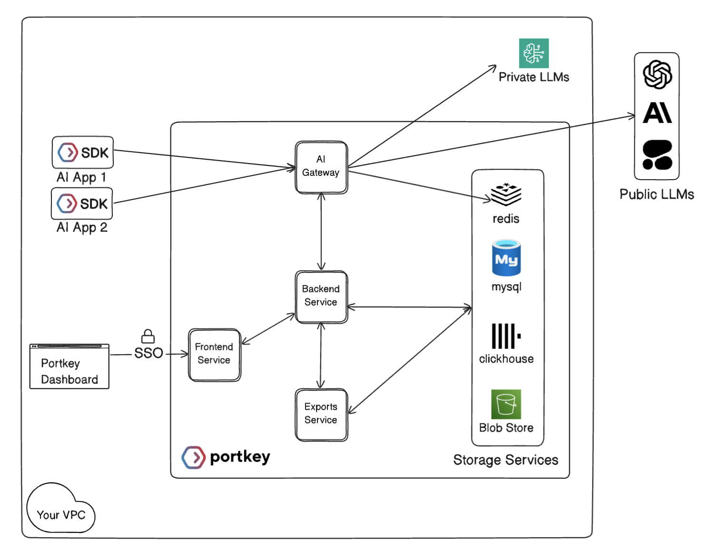

## Portkey Architectural Overview

Portkey's architecture is designed to provide a comprehensive AI application platform within a secure virtual private cloud (VPC) environment. 

### Single Gateway Deployment

### Multi-Gateway Deployment

### Data Flow Diagram

Here's an overview of the key components:

## Services

### 1. AI Gateway

-   Serves as the central hub for routing AI requests to appropriate services (private or public LLMs).
-   Interfaces with AI applications and the backend service.
-   Gateway can be configured inside the same K8 cluster or outside.

### 2. Backend Service

- Rest API server to manage all transactional data and business logic.
- Uses MySql and Redis to store and manage all user, organization and other data.

### 3. Frontend Service

- Portkey's frontend service (Web UI) is a React app that is served via nginx.
- This service also acts as a gateway to the backend service.

### 4. Exports Service

- Manages data export functionalities.
- Uses Clickhouse and Blob Store to store and manage all export data.

## Storage Services

>Portkey automatically spawns all the storage services(except Blob Store) in a single kubernetes cluster by default. This allows for extremely quick setup and testing. All storage can be configured to use an externally managed database service.

>We strongly recommend using a externally managed database service for production use.

### 1. Redis
- In-memory data structure store, used for caching.
- Portkey uses Redis to cache data and reduce the load on the gateway and backend service.

### 2. MySQL

- Relational database for structured data storage.
- Portkey uses MySQL to store all user, organization and other data.

### 3. Clickhouse

- Column-oriented DBMS for analytics and data warehousing.
- Portkey uses Clickhouse to store and manage all analytics and reporting data.

### 4. Blob Store
- Object storage for unstructured data.
- Portkey uses Blob Store to store all raw logs generated by the gateway via LLM interactions.

NEXT: [Configuration](./configuration.md)