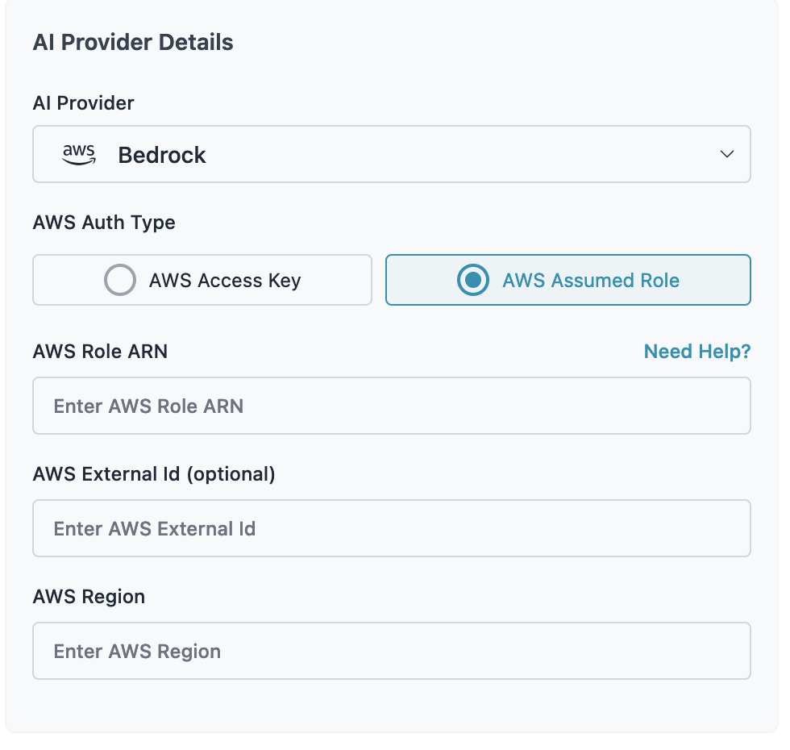

# AWS Bedrock Assumed Role Configuration

This document provides a simplified guide for configuring AWS assumed roles to access Amazon Bedrock services with Portkey Gateway.

## Overview

To use Amazon Bedrock with Portkey Gateway, you need to configure AWS assumed roles with the appropriate permissions. This allows the gateway to authenticate with AWS and invoke Bedrock models on your behalf.

Alternatively you can use an access token and secret key id, but using assumed roles is a more secure and recommended way to interact with Bedrock.

## Step 1: Create Bedrock IAM Policy

Create an IAM policy with the necessary Bedrock permissions. Scope `Resource` to the specific foundation models / inference profiles you actually invoke — avoid `"Resource": "*"` in production:

```json
{
  "Version": "2012-10-17",
  "Statement": [
    {
      "Effect": "Allow",
      "Action": [
        "bedrock:InvokeModel",
        "bedrock:InvokeModelWithResponseStream"
      ],
      "Resource": [
        "arn:aws:bedrock:<REGION>::foundation-model/anthropic.claude-3-7-sonnet-*",
        "arn:aws:bedrock:<REGION>:<ACCOUNT_ID>:inference-profile/*"
      ]
    }
  ]
}
```

> **Least-privilege note:** `"Resource": "*"` is only acceptable for short-lived exploration. For production, list the specific foundation-model ARNs you invoke. Overly broad Bedrock permissions combined with a pod compromise could be used to exfiltrate data through any model in the account.

## Step 2: Role Configuration Options

You have two options for attaching the policy:

### Option A: Attach to Principal Role
Attach the Bedrock policy directly to your existing principal role (the role used for log storage).

### Option B: Create Separate Bedrock Role
Create a dedicated role for Bedrock access with the following trust relationship:

```json
{
  "Version": "2012-10-17",
  "Statement": [
    {
      "Effect": "Allow",
      "Principal": {
        "AWS": [
          "<Bedrock Role ARN>"
        ]
      },
      "Action": "sts:AssumeRole",
      "Condition": {
        "StringEquals": {
          "sts:ExternalId": "<External ID>"
        }
      }
    }
  ]
}
```

## Step 3: Authentication Method Configuration

Choose one of the following authentication methods:

### Method 1: Long-term Credentials
Add the following environment variables to your `values.yaml`:

```yaml
environment:
  data:
    AWS_ASSUME_ROLE_ACCESS_KEY_ID: <your-access-key>
    AWS_ASSUME_ROLE_SECRET_ACCESS_KEY: <your-secret-key>
    AWS_ASSUME_ROLE_REGION: <your-region>
```

### Method 2: IRSA (IAM Roles for Service Accounts) for EKS — Recommended
- Use the role attached to your EKS service account as the principal role
- No additional environment variables needed for authentication
- Eliminates SSRF-to-IMDS credential theft on EKS worker nodes

### Method 3: IMDS (Instance Metadata Service) for EC2
- Use the role attached to your EC2 instance as the principal role
- No additional environment variables needed for authentication

> ⚠️ **Security notice**
> - Use IRSA (Method 2) on EKS instead of IMDS whenever possible.
> - If you must use IMDS, the node **must** enforce IMDSv2 (`HttpTokens=required`, `HttpPutResponseHopLimit=1`) to prevent SSRF from a pod reaching the metadata endpoint and stealing node credentials.
> - Do **not** set `AWS_IMDS_V1=true`. IMDSv1 fallback is deprecated and is a direct SSRF amplifier.
> - Also enable the chart's `networkPolicy` to block pod egress to `169.254.169.254`.

## Step 4: Virtual Key Creation

When creating Virtual Keys in Portkey, provide:

- **Bedrock AWS Role ARN**: The ARN of the role with Bedrock permissions (Principal or Separate role)
- **Bedrock AWS External ID**: (Optional) The external ID for additional security
- **Bedrock AWS Region**: The AWS region where your Bedrock models are available



## Additional configurations

### Using Inference Profiles
To use inference profiles (ex: arn:aws:bedrock:us-east-1:51711235636:application-inference-profile/jovk7oauswit) in model field instead of foundation models (ex: anthropic.claude-3-7-sonnet-20250219-v1:0),
the assumed role additionally needs to have access to the following Actions and resources

```json
{
    "Version": "2012-10-17",
    "Statement": [
        {
            "Effect": "Allow",
            "Action": [
                "bedrock:GetInferenceProfile"
            ],
            "Resource": [
                "arn:aws:bedrock:*:*:inference-profile/*",
                "arn:aws:bedrock:*:*:application-inference-profile/*"
            ]
        }
    ]
}
```

## Important Notes

- Ensure the role ARN used in Virtual Key creation matches the role with Bedrock policy attached
- External ID is optional but recommended for enhanced security
- The principal role must have appropriate trust relationships configured
- Test the configuration with a simple Bedrock model invocation before production use

## Troubleshooting

If you encounter authentication issues:

1. Verify the trust relationship is correctly configured
2. Ensure the Bedrock policy is attached to the correct role
3. Check that the role ARN in Virtual Keys matches your configuration
4. Validate that the AWS region supports your chosen Bedrock models